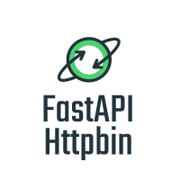

# FastAPI Httpbin

HTTP Endpoints for easy testing of your app.

Built with the [FastAPI Framework for Python](https://fastapi.tiangolo.com/), this is heavily based on the original [Httpbin](https://httpbin.org/) website.

Play with it in production at [https://httpbin.dmuth.org/](https://httpbin.dmuth.org/)  Documentation for all endpoints is right on the front page of the site.  What are you waiting for? :-)

Also consider these add-ons I wrote which make use of the API:

- [Dead Simple QR Code Generator](https://httpbin.dmuth.org/qrcode/)
- [Test Password Managers like 1Password and BitWarden here](https://httpbin.dmuth.org/test-password-manager-form/)

## Differences between this app and Httpbin

- 100% unit test coverage of all endpoints.
- Ensured that [documentation](https://httpbin.dmuth.org/) 100% matches the responses returned.
- Ensured that all values are now sanity checked
- All endpoints with mandatory parameters now have examples in the documentation in order to reduce friction for test usage.
- Fixed a few bugs found in the implementation of the `/cache` endpoints in Httpbin.
- Several endpoints have `GET` version only, as I did not see the point to supporting every possible HTTP verb--I felt that this just made the Swagger documentation unwieldly. (This is subject to change based on usage patters and demand)

## Development

To run FastAPI Httpbin in development mode so that changes to the underlying Python files
are automatically reloaded:

- Directly
  - `pip install -r ./requirements.txt`
  - `PORT=9000 ./bin/dev.sh` - Run server in dev mode on port 9000, so that changes to the Python scripts cause them to be reloaded
- Or, in Docker if you'd prefer:
  - `./bin/docker-build.sh` - Build the Docker container
  - `./bin/docker-dev.sh` - Start the Docker container and spawn a bash shell so that scripts can be run from inside the container.
    - Note that the host directory lives in `/mnt/`.
    - Then run `./pytest.sh`
      - Run `./pytest.sh -v` to view individual test names as they run
      - Run `./pytest.sh -k NAME` to limit tests to a specific test by name
    - Or run `./bin/dev.sh`, however changes to files may not be caught.

## Deployment

- Bump version number in `./lib/fastapi.py`.
- `./bin/docker-build.sh` - Build the Docker container
- `./bin/deploy.sh` - This will run `fly deploy` to deploy the container on Fly.io.
- `./bin/docker-push.sh` - This will push the Docker image to Docker Hub

## In production

- `./bin/prod.sh` - Run in production mode, so that changes made to the Python scripts do NOT cause reloads.
- `./bin/docker-prod.sh` - Run the Docker container in production mode (detached from the console).

## FAQ: Are there any bugs?

### How about Kubernetes Support?

Look in [k8s/README.md](k8s/README.md) for Kubernetes instructions.  I built that out using
k3s with k3d, but those files should work reasonably well in a full blown k8s environment.

### Docker-in-Vagrant Issues

If you are [running Docker from Vagrant](https://github.com/dmuth/docker-in-vagrant), the app won't
behave right when run in Development Mode inside of a container.  Specifically, the functionality of FastAPI to reload itself when a file is changed does not seem to work. For now, the workaround is to restart the FastAPI server when new changes are to be tested, or to not run it in a container in the first place.

Production use is unaffected.

## Get In Touch

If you run into any problems, feel free to [open an issue](https://github.com/dmuth/fastapi-httpbin/issues).

Otherwise, you can find me [on Twitter](https://twitter.com/dmuth), [Facebook](https://facebook.com/dmuth), or drop me an email: **doug.muth AT gmail DOT com**.

